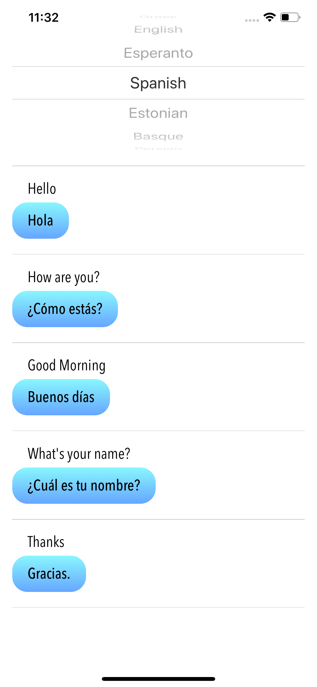
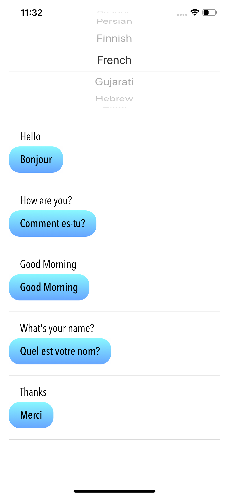
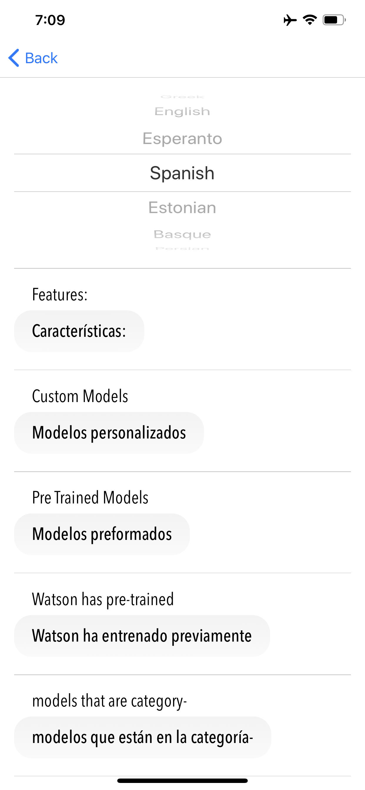
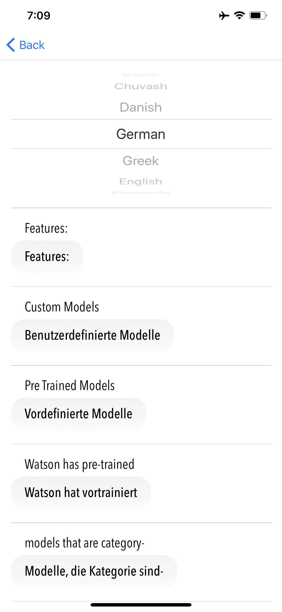
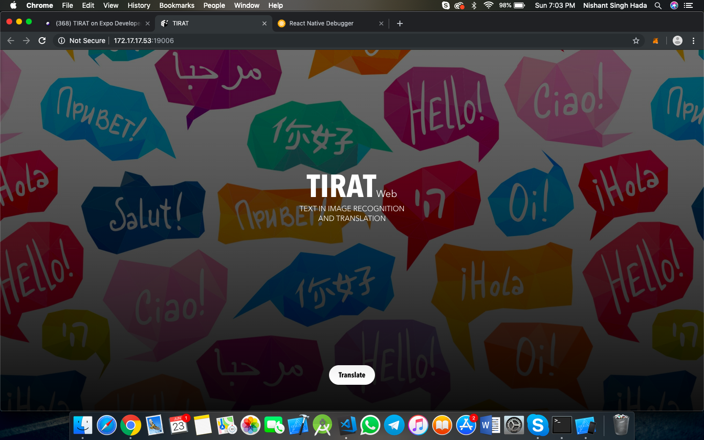

# ReactNative-TIRAT
### Text in Image Recognition and Translation. 

TIRAT is a cross-platform multi-screen app which detects the text in an image and provides translations in different languages selected by the user.  

### Screenshots 

      
      

### Used

* React Native
* Expo
* ObjectiveC Xcode
* Java AndroidStudio
* JavaScript CSS
* IBM Watson API
* Cloud Vision API

### Functionality

* Initially user clicks or selects an image from camera roll and app gets the base64 string.
* This base64 string is passed as the body in Google Cloud Vision API to get the text and language in it. 
* The app routes to translation screen where initially all supported languages are fetched from IBM Watson language-translate API.
* User then can pick any language from the list and the translations are shown which are fetched from IBM Watson Language-Translate API for all text instances found by Cloud Vision API. 

